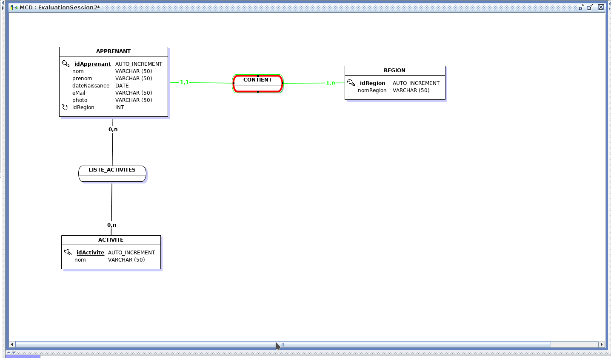
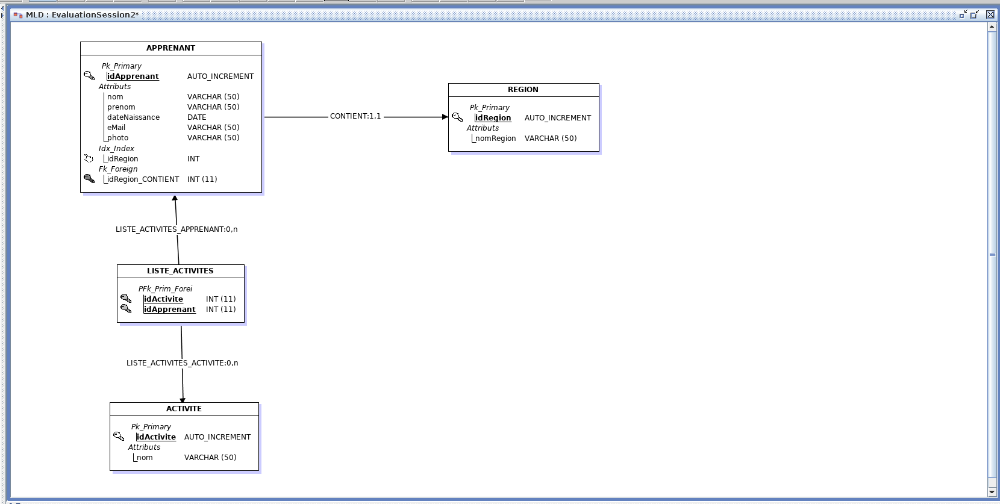

# EvaluationSession2 #

**Gestion d'une base de données depuis java avec JDBC**

Le programme permet de manipuler une base de données en consultation et en édition

## Mise en place projet ##

### Création base de données ###

Création MCD à partir du cahier des charges avec Jmerise
Générer MLD et Script SQL
Création base de données avec MySQL Workbench et PHPMyAdmin
Ajouts des informations dans les tables

### Configuration espace de travail ###

Création repository Github
Création projet sur Eclipse
Liaison du projet avec le repository
Configuration Build Path avec le connecteur MySQL Java

## Architecture application ##

### Packages ###

- connection : liaison à la base de données
- main : méthode principale
- metier : méthodes mappings, affichages et requêtes
- model : objets instanciés des tables de la base de données

#### Main ####

Méthode principale ouvrant un menu avec toutes les requêtes possibles

#### Metier ####

- Mapping : methodes pour instancier en objet les données SQL
- MethodesAffichages : methodes d'affichage des résultats des différentes requêtes
- Requetes : methodes utilisant la base données sans la modifier
- RequetesUpdate : methodes modifiant la base données

#### Model ####

Apprenant, Activite et Region :
Classes qui reprennent les caractéristiques des tables de la base de données
